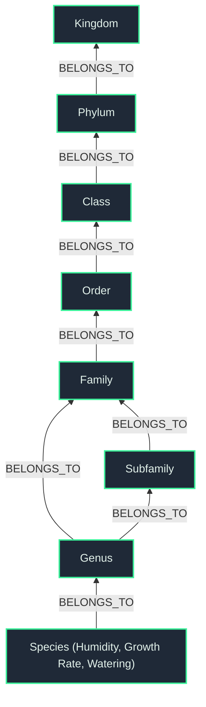

# FloGraph: Botanical Knowledge Graph 🌱

A full-stack Graph Database implementation for horticultural taxonomy and plant care data. This repository showcases the power of **Neo4j** and **Next.js**.

## Project Architecture

This project consists of a unified Next.js application, an AI-assisted Markdown ingestion pipeline, and an optimized graph database:

1. **[Next.js Web App](./webapp):** A stunning, dark-mode web application built on Next.js. It features a public interface for interactive Graph-BFS exploration (Network vs Lineage mode) and a Notion-style Admin Dashboard for manually updating plant data.
2. **Python Sourcing Engine:** A set of scripts that parse raw horticultural Markdown files and CSV data, use biological heuristics to infer environmental needs, and inject them into the Neo4j database.

---

## The Graph Schema

The database leverages an optimized taxonomy backbone. All care properties (e.g. `humidity`, `growthRate`, `wateringLevel` 1-5 scale), regions, and pollinators are flattened directly into the `Species` nodes for maximum retrieval efficiency, while preserving the strict biological taxonomy hierarchy in the relationships.



---

## Quick Start

### 1. Environment Setup
Create a `.env` file in the root directory containing your Neo4j and Gemini API credentials:
```env
NEO4J_URI=bolt://localhost:7687
NEO4J_USER=neo4j
NEO4J_PASSWORD=your_password

GEMINI_API_KEY=your_gemini_api_key
```

### 2. Generating Data
The hybrid sourcing engine fetches strict taxonomy from GBIF and passes it to Gemini to generate horticultural data (water needs, sunlight, companions, pollinators).
```powershell
# Run the mass sourcer to generate hundreds of plants across 20 botanical families
powershell -ExecutionPolicy Bypass -File sourcing/mass_source.ps1
```

### 3. Launching the App
Run the backend and frontend simultaneously to explore the database visually!

**Start the API:**
```bash
cd api
uvicorn main:app --reload --host 0.0.0.0 --port 8000
```

**Start the Web App:**
```powershell
cd webapp
npm run dev
```
Open `http://localhost:3000` in your browser.

---
*Built as a showcase for Neo4j Graph Database implementation and AI-driven data pipelines.*
