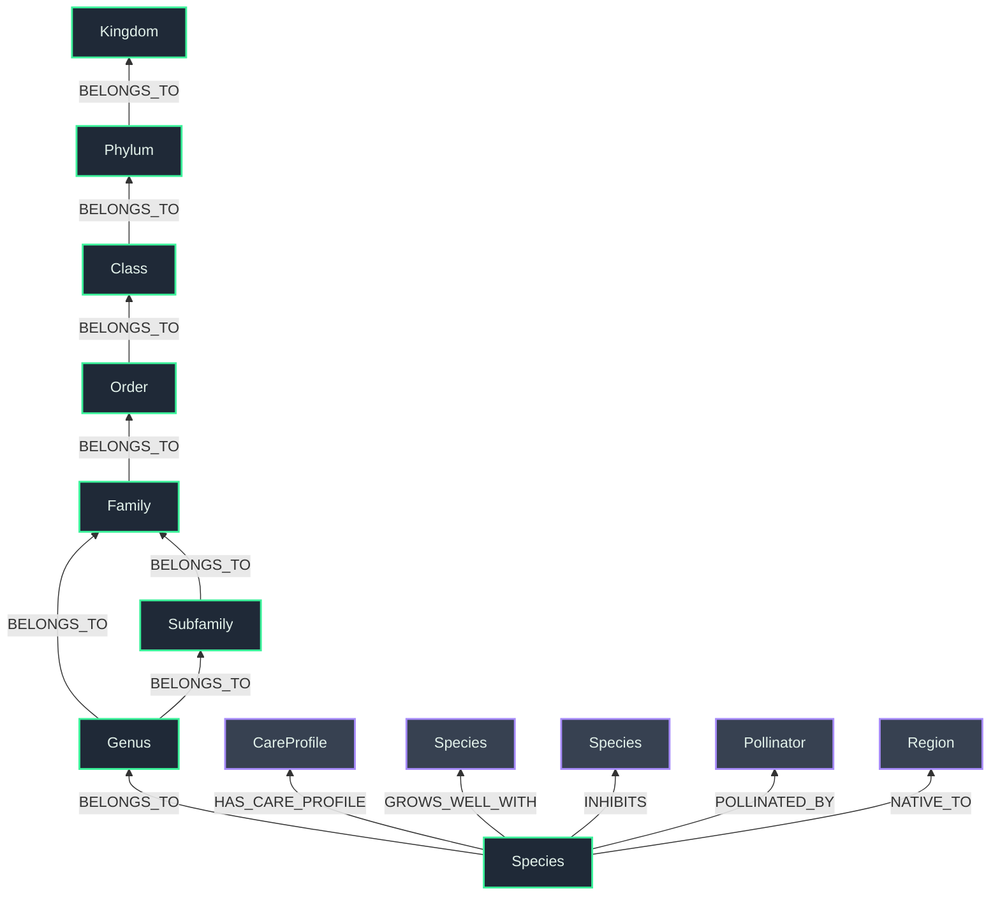

# FloGraph: Botanical Knowledge Graph 🌱

A full-stack, AI-powered Graph Database implementation for horticultural taxonomy and plant care data. This repository showcases the power of **Neo4j**, **FastAPI**, and **React** integrated with LLM-driven data generation pipelines.


## Project Architecture

This project is divided into distinct, decoupled services:

1. **[Data Sourcing](./sourcing/README.md):** A hybrid pipeline bridging the strict biological taxonomy of the **GBIF API** with the rich horticultural context of **Google Gemini 2.5 Flash**.
2. **[Graph Ingestion](./ingestion/README.md):** Cypher-based ETL scripts utilizing the Neo4j Python Driver to map raw CSVs into highly optimized, deduplicated graph structures.
3. **[FastAPI Backend](./api/README.md):** A lightweight Python REST API serving dynamic hierarchical data from Neo4j Aura.
4. **[React Visualizer](./visualizer/README.md):** A stunning, dark-mode web application using `ForceGraph2D` to interactively explore the botanical taxonomy.

---

## The Graph Schema

The database leverages an optimized **Many-to-1 Shared Hub** model. Instead of assigning individual properties to every plant, hundreds of species share identical `CareProfile` nodes, drastically reducing redundancy and allowing for instantaneous "Similar Plant" recommendations via graph traversal.



---

## Quick Start

### 1. Environment Setup
Create a `.env` file in the root directory containing your Neo4j and Gemini API credentials:
```env
NEO4J_URI=bolt://localhost:7687
NEO4J_USER=neo4j
NEO4J_PASSWORD=your_password

GEMINI_API_KEY=your_gemini_api_key
```

### 2. Generating Data
The hybrid sourcing engine fetches strict taxonomy from GBIF and passes it to Gemini to generate horticultural data (water needs, sunlight, companions, pollinators).
```powershell
# Run the mass sourcer to generate hundreds of plants across 20 botanical families
powershell -ExecutionPolicy Bypass -File sourcing/mass_source.ps1
```

### 3. Launching the App
Run the backend and frontend simultaneously to explore the database visually!

**Start the API:**
```bash
cd api
uvicorn main:app --reload --host 0.0.0.0 --port 8000
```

**Start the Visualizer:**
```powershell
cd visualizer
powershell -ExecutionPolicy Bypass -Command "npm run dev"
```
Open `http://localhost:5173` in your browser.

---
*Built as a showcase for Neo4j Graph Database implementation and AI-driven data pipelines.*
