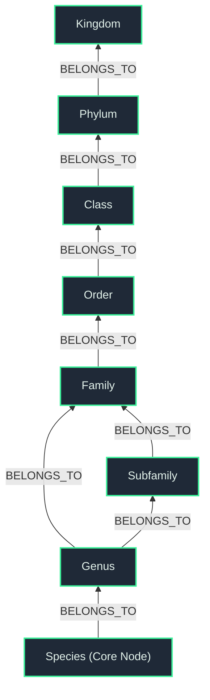

# Botanical Knowledge Graph Schema

This repository leverages a Graph Database (Neo4j) to represent the biological taxonomy and care information of hundreds of botanical species.

## Taxonomy Backbone
The core structure of the database is an optimized taxonomy tree representing the biological lineage of every plant. The nodes are connected via a `BELONGS_TO` directional relationship, starting from the `Species` node and travelling up to the `Kingdom` node.

## Flat Properties Architecture
Instead of separating care requirements (Watering, Sunlight, Humidity, Growth Rate) into separate disconnected nodes, we flatten all horticultural properties directly onto the `Species` node. This guarantees incredibly fast O(1) retrieval speeds when a user requests the care profile of a specific plant.

### Species Node Properties:
- `name` (String): e.g. "Monstera deliciosa"
- `commonName` (String): e.g. "Swiss Cheese Plant"
- `wateringLevel` (Integer 1-5): 1 = Extremely Dry, 5 = Aquatic
- `humidity` (Integer 0-100): Percentage of humidity required.
- `growthRate` (Integer 0-100): Percentage metric of growth speed.
- `ppfdMin` / `ppfdMax` (Integer): Minimum and maximum sunlight requirements.
- `toxicity` (String): Toxic properties for pets/humans.
- `soilType` (String): Optimal soil conditions.

## Ancillary Nodes
While core stats are flattened, certain complex one-to-many relationships are represented via separate nodes:
- **`Pollinator`**: Connected via `HAS_POLLINATOR`. Represents insects or animals (e.g., "Hummingbirds", "Bees") that pollinate the plant.
- **`Region`**: Connected via `NATIVE_TO`. Represents geographical origins.
- **`Companions`**: Species nodes can connect to *other* Species nodes via a `COMPANION` relationship, indicating that the two plants thrive when planted near each other.
